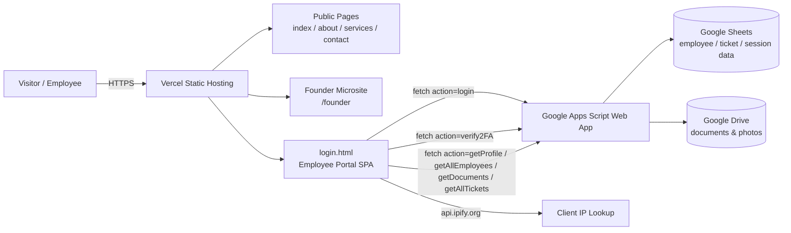
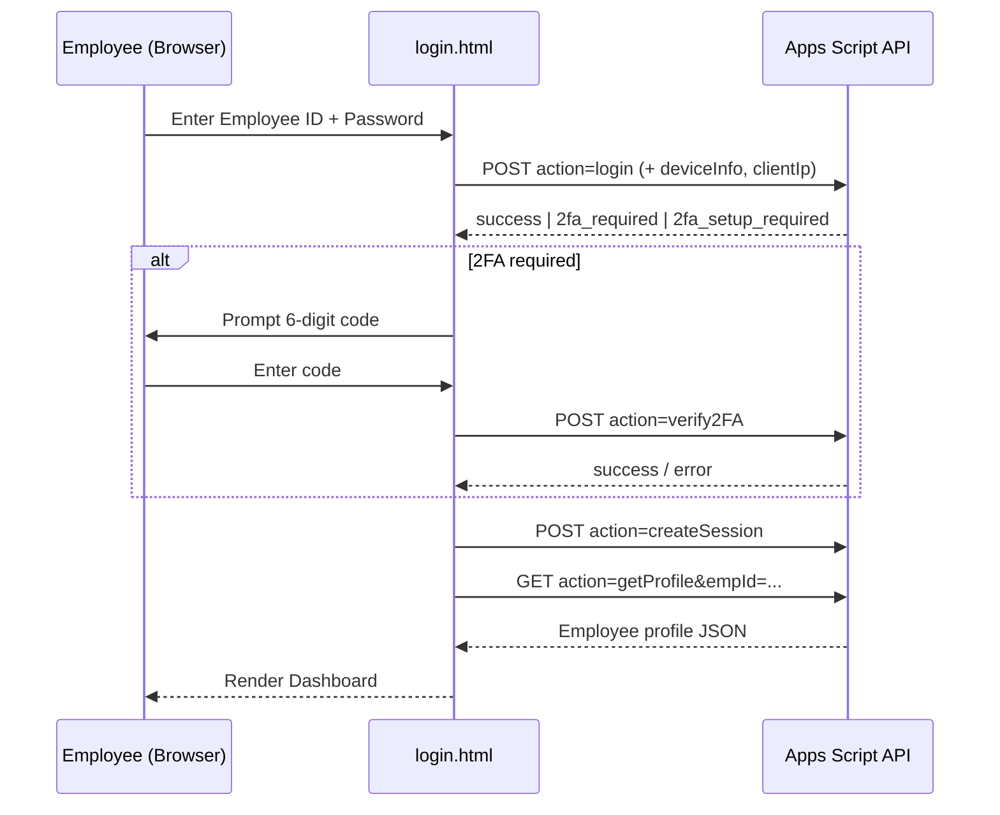

<div align="center">


<a href="https://raw.githubusercontent.com/trimithathecompany/trimitha/main/public/Images/Trimitha%20Logo.png">
  
</a>

### The public marketing site & internal employee portal for **Trimitha**

<a href="https://git.io/typing-svg">
  
</a>

[](https://www.trimitha.co.in)
[](./LICENSE)
[](https://github.com/trimithathecompany/trimitha)
[](https://github.com/trimithathecompany/trimitha/commits/main)

[](https://github.com/trimithathecompany/trimitha/stargazers)
[](https://github.com/trimithathecompany/trimitha/network/members)
[](https://github.com/trimithathecompany/trimitha/issues)
[](https://github.com/trimithathecompany/trimitha/pulls)
[](https://github.com/trimithathecompany/trimitha/commits/main)
[](https://github.com/trimithathecompany)

</div>


## 📚 Table of Contents

- [About the Project](#-about-the-project)
- [Features](#-features)
- [Tech Stack](#-tech-stack)
- [Architecture](#-architecture)
- [Folder Structure](#-folder-structure)
- [Getting Started](#-getting-started)
- [Configuration](#-configuration)
- [The Employee Portal (`login.html`)](#-the-employee-portal-loginhtml)
- [Backend / API Reference](#-backend--api-reference)
- [Security Notes](#-security-notes)
- [Deployment](#-deployment)
- [SEO & Discoverability](#-seo--discoverability)
- [Contributing](#-contributing)
- [License](#-license)
- [Founders](#-founders)
- [Support](#-support)
- [Star History](#-star-history)


## 🧭 About the Project

**Trimitha** is a **static, multi-page company website** for Trimitha — a technology company built around the pillars of **Trust, Thought, and Technology**, founded by **Polanki Thrinath**. The repository holds the entire public-facing site (home, about, services, contact, legal pages) plus a self-contained, in-browser **employee portal** used for internal HR-style operations (profiles, tickets, documents).

There is no backend framework, build tool, or package manifest in this repo — every page is a hand-authored `.html` file styled with the **Tailwind CSS CDN build** and enhanced with vanilla JavaScript. The one exception is the employee portal, which talks to an **external Google Apps Script Web App** as its API layer.

**Who this repo is for:**
- Visitors / prospective clients looking to learn about Trimitha and its product lines
- Trimitha employees who need portal access (profile, documents, IT tickets, HR data)
- Developers maintaining or extending the static site or its Apps-Script-backed portal

## ✨ Features

| Area | What actually exists in the repo |
|---|---|
| 🏠 **Marketing site** | `index.html`, `about.html`, `services.html`, `contact.html` — responsive, SEO-tagged pages |
| 🧩 **Product showcase** | Services page highlights Trimitha's ventures: **Ideas to Moves**, **Rxplain**, **Costique**, **KanAura** |
| 👤 **Founder microsite** | `/founder` sub-site with dedicated pages: `index`, `personal`, `portfolio`, `blog`, `coo`, `legal` |
| 🔐 **Employee login** | Employee-ID + password auth, driven entirely from `login.html` |
| 🛡️ **Two-Factor Auth** | TOTP-based 2FA with QR-code enrollment and 6-digit code verification |
| 🕵️ **Session security** | Server-side session creation, device fingerprinting, and client IP capture attached to every API call |
| 🗂️ **Employee directory** | View / add / edit employees, view & update salary information |
| 📁 **Document center** | Folder-based document browser backed by Google Drive file links |
| 🎫 **IT Ticketing** | Submit, assign, solve, close, and reopen support tickets from inside the portal |
| 📈 **Activity & login history** | Per-employee activity log and login history views |
| 🧾 **Legal pages** | `privacy.html`, `terms.html`, `disclaimer.html`, plus a nested `ECO/PrivacyPolicy` page |
| 🔍 **SEO baked in** | Open Graph, Twitter Card, canonical tags, JSON-LD `Organization` schema, `sitemap.xml`, `robots.txt` |

## 🛠 Tech Stack

<table>
<tr><td>

**Markup & Styling**
- HTML5 (hand-authored, multi-page)
- [Tailwind CSS](https://tailwindcss.com) — loaded via CDN (`cdn.tailwindcss.com`), no build step
- Google Fonts — **Inter** & **Montserrat**

</td><td>

**Client Scripting**
- Vanilla JavaScript (`<script>` blocks per page)
- [Lucide Icons](https://lucide.dev) via `unpkg`
- `fetch` API with a custom global interceptor for the portal

</td></tr>
<tr><td>

**Backend / API**
- **Google Apps Script Web App** (`script.google.com/macros/.../exec`) as the entire serverless API layer for the employee portal
- Google Drive used as file/document storage (Drive share links are transformed to direct image links client-side)

</td><td>

**Hosting & Ops**
- **Vercel** static hosting (`public/vercel.json` configures URL rewrites for `/founder`)
- No package manager, bundler, or CI/CD pipeline is present in this repository — it is deployed as plain static files

</td></tr>
</table>

> No `package.json`, database schema, or server source is checked into this repo. The employee-portal "backend" lives entirely inside an external Google Apps Script deployment referenced by the `API_URL` constant in `login.html`.

## 🏗 Architecture





## 📁 Folder Structure

```text
trimitha/
├── LICENSE                     # MIT License
└── public/                     # Everything Vercel serves as static content
    ├── index.html              # Home page
    ├── about.html               # About Trimitha
    ├── services.html            # Product/venture showcase
    ├── contact.html              # Contact page
    ├── login.html                # Employee portal (SPA, ~6k lines)
    ├── privacy.html               # Privacy policy
    ├── terms.html                 # Terms of service
    ├── disclaimer.html             # Disclaimer
    ├── robots.txt                  # Search-engine crawl rules
    ├── sitemap.xml                  # XML sitemap
    ├── vercel.json                   # Vercel rewrite rules for /founder
    ├── Trimitha Logo.png              # Root-level logo asset
    ├── Images/                         # Brand & product image assets
    │   ├── Trimitha Logo.png / TrimithaLogo.png / Trimitha Main.png
    │   ├── Rxplain.png, Costique Logo.png, IdeasToMoves.png, KanAura.png
    │   └── Images Readme.md            # Notes on image usage
    ├── ECO/                              # Secondary/legacy micro-pages
    │   ├── Images/Trimitha Logo.png
    │   └── PrivacyPolicy/index.html
    └── founder/                            # Founder microsite (rewritten to `/founder`)
        ├── index.html, personal.html, portfolio.html
        ├── blog.html, coo.html, legal.html
        ├── Readme.md
        ├── Trimitha Logo.png
        └── tpimgs/                          # Founder & COO photography
```

## 🚀 Getting Started

Since this is a **static site with no build step**, running it locally only requires a static file server.

```bash
# 1. Clone the repository
git clone https://github.com/trimithathecompany/trimitha.git
cd trimitha

# 2. Serve the "public" folder with any static server
npx serve public
# — or —
python3 -m http.server 8080 --directory public

# 3. Open in the browser
# http://localhost:3000  (serve)  or  http://localhost:8080 (python)
```

There is no install step, no environment file, and no build command — every asset in `public/` is served as-is.

## ⚙️ Configuration

The only "configuration value" in the codebase is the Apps Script endpoint hard-coded near the top of `login.html`:

```js
const API_URL = "https://script.google.com/macros/s/AKfycbxauGyw.../exec";
```

To point the portal at your own Google Apps Script deployment, replace this constant with your deployment's `/exec` URL. There is no `.env` file, secrets manager, or server-side config in this repository — all portal configuration is client-side.

## 🔐 The Employee Portal (`login.html`)

`login.html` is effectively a single-page application bundled inside one HTML file. Verified flow, straight from the source:

1. **Step 1 — Credentials:** Employee ID (e.g. `TM-4021`) + password are POSTed with a device fingerprint (`navigator.userAgent`, screen size, timezone, etc.) and the client's public IP (fetched from `api.ipify.org`).
2. **Step 2 — 2FA:** If enrolled, the server responds `2fa_required` and the user enters a 6-digit TOTP code. First-time users get `2fa_setup_required`, complete with a generated QR code and manual secret.
3. **Session:** On success, a server-side session is created (`action=createSession`) before the dashboard renders.
4. **Dashboard:** Tabs for **Profile**, **Employee Directory** (add/edit/salary), **Documents** (Drive-backed folders/files), **Tickets**, and **Activity/Login History**.

A global `fetch` interceptor automatically appends the cached client IP to every request made to the Apps Script API.

## 🔌 Backend / API Reference

All portal requests hit the single Google Apps Script endpoint (`API_URL`) with an `action` query parameter or POST field. Every action below is called directly from `login.html`:

| Action | Method | Purpose |
|---|---|---|
| `login` | POST | Verify Employee ID + password, kicks off 2FA if enabled |
| `verify2FA` | POST | Validate a 6-digit TOTP code (setup or standard login) |
| `createSession` | POST | Establish a server-side session after successful login |
| `logout` | POST | Invalidate the current session |
| `getProfile` | GET | Fetch a single employee's profile |
| `getAllEmployees` | GET | Fetch the full employee directory |
| `addEmployee` | GET | Add a new employee record |
| `updateEmployee` | GET | Update an existing employee record |
| `getLoginHistory` | GET | Fetch login history for an employee |
| `getActivityLog` | GET | Fetch an employee's activity log |
| `getDocuments` | GET | List documents/folders |
| `downloadFile` | GET | Fetch a document/file by ID |
| `getAllTickets` / `getMyTickets` | GET | List all IT tickets / the current user's tickets |
| `submitTicket` | POST | Create a new support ticket |
| `updateTicket` (`assign` / `solve` / `close` / `reopen`) | POST | Change a ticket's status |

> The Apps Script source itself is **not** part of this repository — it's an external deployment. The table above reflects only the client-side calls found in `login.html`.

## 🛡 Security Notes

- 2FA is implemented via TOTP with QR-code enrollment, not just password auth.
- A password strength meter enforces 8–14 characters with mixed case, numbers, and symbols on setup.
- Every API request is tagged with a device fingerprint and client IP for audit/session purposes.
- Because `API_URL` and all logic are client-side, the Apps Script deployment itself is responsible for authorization/rate-limiting — there is no server code in this repo to review for that.

## 🌐 Deployment

The site is deployed on **Vercel** (see the live badge above, pointing at `trimitha.co.in`). The only deployment configuration present is `public/vercel.json`:

```json
{
  "rewrites": [
    { "source": "/founder", "destination": "/founder/" },
    { "source": "/founder/index.html", "destination": "/founder/" }
  ]
}
```

Deploying your own copy is a standard static-site Vercel import — no build command or output directory override is required since `public/` already contains the deployable assets.

## 🔍 SEO & Discoverability

- Per-page `<meta>` description/keywords, canonical tags, and `hreflang`
- Open Graph + Twitter Card metadata on `index.html`
- `schema.org` **Organization** JSON-LD with founder/employee/event data
- `robots.txt` allowing full crawl, pointing to `sitemap.xml`
- `sitemap.xml` listing all primary public routes

## 🤝 Contributing

1. Fork the repo and create your branch: `git checkout -b feature/your-feature`
2. Make your changes directly to the relevant `.html` file(s) under `public/`
3. Commit: `git commit -m "Describe your change"`
4. Push and open a Pull Request against `main`

Since there's no build pipeline, please manually verify changed pages render correctly in a browser before opening a PR.

## 📄 License

Distributed under the **MIT License**. See [`LICENSE`](./LICENSE) for the full text.

```
MIT License
Copyright (c) 2026 trimithathecompany
```

## 👥 Founders

<div align="center">

| Polanki Thrinath | Polanki Bala Thripura |
|---|---|
| CEO & Founder | COO & President |
| [LinkedIn](https://www.linkedin.com/in/thrinathpolanki) · [Twitter](https://twitter.com/thrinathpolanki) · [Instagram](https://www.instagram.com/thrinath.polanki) · [GitHub](https://github.com/thrinathpolanki) | Described in the site's schema markup as a "human-centric AI" COO & President |

</div>

**Connect with Trimitha:** [Website](https://www.trimitha.co.in) · [LinkedIn](https://www.linkedin.com/company/trimitha) · [Twitter](https://twitter.com/trimithacompany) · [Instagram](https://www.instagram.com/trimitha.co/)

## 💬 Support

- 🐛 Found a bug? [Open an issue](https://github.com/trimithathecompany/trimitha/issues)
- 💡 Have an idea? Start a discussion in the Issues tab
- 📧 Reach the team via the [Contact page](https://www.trimitha.co.in/contact.html)

## ⭐ Star History

<a href="https://star-history.com/#trimithathecompany/trimitha&Date">
  
</a>


<div align="center">Made with ❤️ by <a href="https://github.com/trimithathecompany">Trimitha</a></div>
